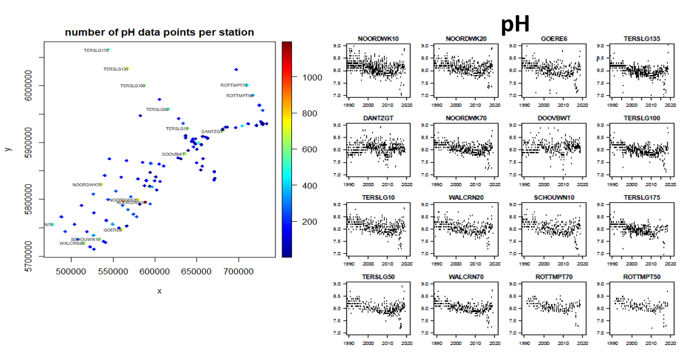
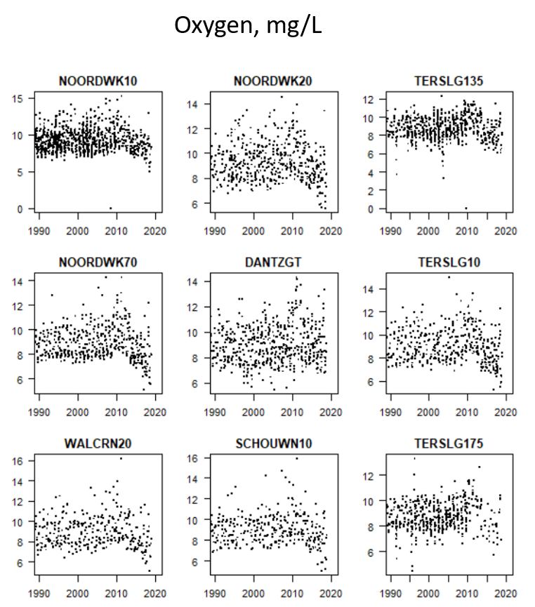

# Physico-chemical and commercial shellfish species data to illustrate potential vulnerability to ocean acidification

## Directory structure

```
{{directory_name}}/
├── analysis
├── data/
│   ├── derived_data/
│   └── raw_data/
├── docs/
├── img/
├── product/
└── scripts/
```

- **analysis** - Markdown or Jupyter notebooks
- **data** - Raw and derived data
- **docs** - Rendered reports
- **img** - example images
- **product** - Output product files
- **scripts** - Reusable code

## Data series

The input data sources used for this proof of concept are a combination of different benthic data sets stored in EMODnet biology and EMODnet chemistry, with some additional external data layers to represent the biology and environmental information available at the time of drafting this example. Some of the data layers are listed below, as well as potential new data layers that will be also requested during the next phase of this data product compilation. These are listed below:

·     Benthic data sets (displayed as presence/absence data relative to different benthos species) (https://www.emodnet.eu/en/biology) 

·     Benthic data (stored in https://www.informatiehuismarien.nl/uk/)

·     Temperature data (Data from SeaDataNet and https://www.emodnet.eu/en/physics)- to be requested in phase IV.

·     Nutrients - to be added in phase IV. (stored in https://www.emodnet-chemistry.eu/)

·     Phytoplankton- (https://www.emodnet.eu/en/biology) to be added in phase IV.

 

## Data product

Ocean acidification (OA) and climate change are both influenced by increasing carbon dioxide concentrations coming from the atmosphere. However, the distinction between OA and climate change, is that OA is an alteration of the chemistry of seawater, therefore not a direct climatic process. The ocean is the largest natural reservoir of dissolved carbon and holds an immense buffering capacity for changes in atmospheric CO2 concentrations. The rapid increase of atmospheric CO2 since the industrial revolution has caused oceans and seas to absorb increasingly greater amounts of CO2. This process disturbs the pre-existing chemical equilibrium of the sea, resulting in seas changing their chemical state and altering the ocean pH, becoming more acidic (Birchenough et al., 2017).

OA has become one of the most studied topics in the last ten years (Williamson et al., 2017; Browman 2016). Ongoing efforts are attempting to understand the potential OA effects on biodiversity and biogeochemistry, and the socio-ecological impacts across species and ecosystems. The evidence suggests that OA will act differently across species with some impacts already occurring for sensitive marine species and with direct and indirect repercussions for ecosystems. The direct effects will include changes in species morphology, ecology and behavior whilst indirect effects may be repercussions for processes or higher trophic groups (e.g. wider food web effects and interactions within and between species) (Birchenough et al., 2015).

The observed variability of pH is greatest in coastal waters, which is of importance to commercial shellfisheries and aquaculture. The long-term decline in pH, due to increasing atmospheric CO2, will need to be continuously monitored to understand how these coastal pH changes may be influenced by other stressors and potential repercussions for commercial species (e.g. mussels, cockles, clams, scallops and oyster beds). This product explored with a combination of pH and biological data sources collected over similar periods to provide insight into these linkages over time.

There is still uncertainty on whether the decreasing trend in pH predicted for the oceans will have the same strength in coastal and shallow waters, or if because of secondary drivers like changes in riverine discharges (both quantity and quality), habitat and circulation (Provoost *et al*., 2010), other trends will be dominant. This example has extracted the pH time series for the stations available that had a sufficient number of observations from the time-series study conducted by Provoost *et al*., (2010). Compared to the analysis in Provoost *et al.* (2010), the data series were completed up to the most recent observations. From visual inspection, it is clear that the pH dropped consistently from 1990 till 2013, as was described in the literature. However, in more recent years the pH started to increase again.  (Figure 1). As far as we are aware, the increase from 2013 has not yet been documented. Two exceptions in which this trend is not clear, are the stations DANTZGT and DOOVBWT, which are both located in the Wadden Sea (Figure 1). Concurrent with the trend change in pH, a trend change seems also to occur in  oxygen levels measured in part of the same  stations (Figure 2). Here again, the trend change is not visible in the Wadden Sea station DANTZGT.

Along the same area the existing examples of current biological data based on presence/absence were also presented in a map format. In the Dutch coastal zone, the only commercially exploited species at this moment are *Ensis leei* (recorded as the genus Ensis in the current database). The species *Spisula* sp. (mostly *Spisula subtruncata*) is a commercial species, however, there are no current licences granted for exploitation in the last decade, as these stocks are below the current minimum level required for sustainable exploitation. Further commercial species in the Dutch coastal zone are blue mussels *Mytilus* edulis and cockles *Cerastoderma edule.* The main occurrence of these species, and the only place where exploitation occurs, is in the estuaries and in the Wadden Sea. Currently few data on these areas are available in EMODnet Biology. Included in this document are data on the distribution of commercial bivalve species in the coastal North Sea (*Ensis* sp. and *Spisula subtruncata*) and available data on commercial bivalves exploited in the estuaries (*Mytilus edulis* and *Cerastoderma edule*)(displayed in Figure 3).

The work discussed under this ‘proof of concept’ considers the value of integration of biological and chemical datasets. The preliminary screening of the available pH datasets has helped to illustrate some of the changes observed in the North Sea and Wadden Sea areas. The biological datasets contain extensive information on some species likely to be affected, however, these  data sets are currently not complete enough to also cover the estuaries and Wadden Sea. Completion of the data sets using existing data should be possible, however.

The trend changes observed in pH and oxygen are currently difficult to interpret in terms of causal mechanisms. To better understand the changes that have taken place, additional data will be collected and added to the analysis, in particular data on nutrients, chlorophyll, primary production and composition of the phytoplankton. Most of these data are available in EMODnet, but some may be found elsewhere. A modelling approach will be adopted to understand the mutual correlation between the variables, with the extensive data sets used for calibration and validation.

 This work will advance our knowledge on species presence, abundance and distribution and current changes associated with temperature, pH and oxygen. These multi-variable approaches can help to illustrate the need to understand multiple stressors changes in commercial species. The current need to map, document and understand current and future/expected change in commercial species is of concern, particularly as climate driven variables are changing in marine environments.

 At this stage, this data product presents the first ‘exploratory’ set of relevant data sets. It is envisaged that additional data sets (e.g. nutrients and plankton), during Phase IV of Emodnet Biology. For EMODnet this work has strategic value in two respects. First, by analysing a real-world problem the completeness of the (historic and recent) data in EMODnet is critically tested. With respect to the biological data, for instance, a lack of data on commercial species in the Wadden Sea is apparent. These data exist but are not yet incorporated in EMODnet. Highlighting a useful analysis context may provide additional incentives to add more data into the EMODnet archive. Second, by stressing the link between ecosystem modelling, future projections of the fate of commercial species and use of EMODnet data, we aim to provide a case for tighter interaction between different scientific approaches, as well as between different data holdings. Providing an example of the use of EMODnet data for future projections can help to bridge the gap between data collection and (ecological) modelling.

Figure 1. (Left) Overview of stations containing pH data points as selected by Provoost *et al*., (2010) and (right) detailed set of pH measurements collected along the Wadden and North Sea stations in these stations.




Figure 2. Overview of oxygen (mg/L) levels measured alongside pH  at some of the same stations covered in Figure 1.




Figure 3. Maps of commercial bivalves (*Ensis* sp., *Spisula subtruncata,* *Mytilus edulis* and *Cerastoderma edule*) distributed along the Dutch North Sea coast. The color coding shows the rasterized probability of presence in all benthic samples contained in EMODnet Biology databases. 


##  More information

### References

Birchenough, S., Williamson, P and Turley, C. (2017). Future of the Sea: Ocean Acidification. Foresight – Future of the Sea. Evidence Review. Government Office for Science. Go-Science, 19pp. https://assets.publishing.service.gov.uk/government/uploads/system/uploads/attachment_data/file/645500/Ocean_Acidification_final_v3.pdf

Birchenough, S.N.R., Reiss, H., Degraer, S., Mieszkowska, N., Borja, A., Buhl‐Mortensen, L., Braeckman, U., *et al.* (2015). Climate Change and marine benthos: a review of existing research and future directions in the North Atlantic. Wiley interdisciplinary reviews: Climate Change 03/2015; 6(2):6: 203-223. DOI:10.1002/wcc.330

Browman H.I. (2016). Applying organized skepticism to ocean acidification research. ICES J. Mar. Sci. 2016 73: 529-536. 

Provoost, P., van Heuven, S., Soetaert, K., Laane, R.W.P.M., Middelburg, J.J. (2010) Seasonal and long-term changes in pH in the Dutch coastal zone. Biogeosciences 7: 3869-3878. 

Williamson, P., Turley, C and Ostle, C. (2017). Impacts of ocean acidification. MCCIP Science Review 2016/17.

### Code and methodology

https://github.com/EMODnet/EMODnet-Biology-Shellfish-Ocean-Acidification 

### Citation and download link

Birchenough, SNR., Soetaert, K. and Herman, PMJ (2021). Physico-chemical and commercial shellfish species data to illustrate potential vulnerability to ocean acidification. Integrated data products  created under the European Marine Observation  Data Network (EMODnet) Biology project   (EASME/EMFF/2017/1.3.1.2/02/SI2.789013), funded by the  by the European  Union under Regulation (EU) No 508/2014 of the European Parliament and  of the Council of 15 May 2014 on the European Maritime and Fisheries Fund

Available to download at:

https://www.emodnet-biology.eu/data-catalog?module=dataset&dasid=6619

### Authors 

Biological compilation [Peter Herman](https://www.emodnet-biology.eu/data-catalog?module=person&persid=79), 

Physico-chemical data compilation [Karline Soetaert](https://www.emodnet-biology.eu/data-catalog?module=person&persid=265), 

Overview text, idea and compilation [Silvana Birchenough](https://www.emodnet-biology.eu/data-catalog?module=person&persid=34972)